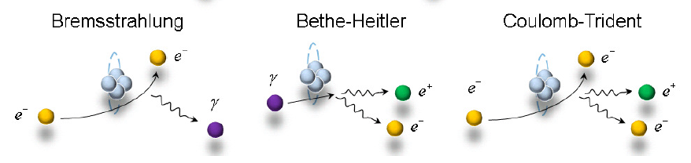

# plot_cross_sections

A set of user-friendly jupyter notebooks plotting the cross-sections of QED processes taking place in relativistic laser-plasma interactions

# Table of Contents

1. [Martinez_Phys_Plasmas_26_103109_2019](#folder1)
    - [notebooks](#subfolder1)
    - [figures](#subfolder2)
2. [Lobet_PhD_Univ_Bordeaux_2015](#folder2)
    - [notebooks](#subfolder1)
    - [figures](#subfolder2)
3. [utils](#folder2)

# Installation and setup

No installation is required.

# Usage

Here are the steps to use this project:

1. **1:** Identify the article you are interested in and go to folder
2. **2:** Identify the figure you would like to reproduce and open the notebook (called figure_x.ipynb)
3. **3:** Run the notebook and observe the result
4. **4:** Feel free to change the physical parameters

Navigate to the notebook, execute it and observe the figure